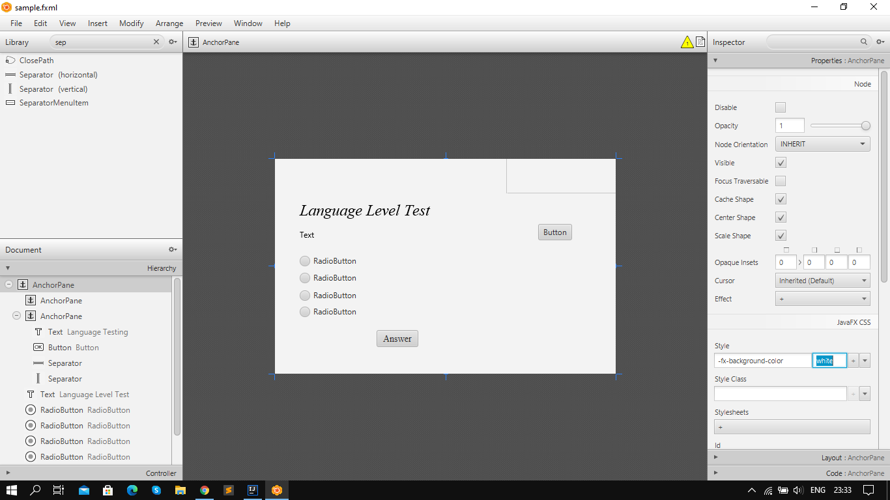

# Project description
It is language level test program, now there is only on langueage, but i want to add more tests soon. 
My program works simply, just run it and then answer all quwstrion, after that you can see your result, and you can just press the button 'Close', and program will authomaticly closed.
## Team
Kachykeev Alisher com19
## ssds
Access to the video only through the [link](https://youtu.be/Ym_KuuS-qD8)
## Images

## File
And here is .jar file: [TestApp.jar](https://github.com/AlisherKachykeev/TestApp/blob/main/TestApp.jar)

